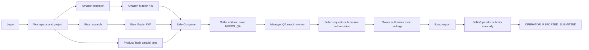

# OmniSeller R4.3 — Amendment A: Final Review Integration and Activation Contract

**Date:** 2026-09-11  
**Status:** `CHANGES INCORPORATED — READY FOR BOUNDED REVIEW; NOT YET ACTIVATED`  
**Scope:** reconcile the GPT1, GPT2 and GPT5-authored independent reviews of R4.3, close their P1 findings, and define the only safe route to implementation. GPT5 is retained here as provenance of the third supplied review; it is not an additional gate owner. The current W0 review roles are GPT1, GPT2 and GPT4.  
**Non-authority:** this file does not authorize cleanup, remote archive creation, merge, deployment or production mutation.

---

## 1. Final ruling

The three reviews agree on the central diagnosis: OmniSeller already contains most of the required engines, but the active product exposes several competing orchestration models at once. The recovery is therefore a **single-path orchestration correction with selective reuse**, not another rewrite.

R4.3 is accepted only as a workflow and cleanup amendment to the existing Golden Point. It does not replace security, tenant isolation, immutable revision binding, Manager QA, exact-package authorization, CI, Linux certification, rollback or Owner release authority.

The consolidated verdict is:

> **ACCEPT THE SINGLE-PATH DIRECTION — ACTIVATE IMPLEMENTATION ONLY AFTER W0 BASELINE AND SCHEMA RECEIPTS PASS.**

The first implementation slice must prove one active workspace, multi-file persistence and a browser journey. It must not begin with broad deletion or another large refactor.

---

## 2. Authority and precedence

When documents conflict, apply this order:

1. `GOLDEN_RULES_V2.json` and accepted R3 security/release invariants;
2. this Amendment A for R4.3 workflow, role and activation corrections;
3. `OMNISELLER_R4_3_SINGLE_PATH_WORKFLOW_REPO_CLEANUP_AND_DELIVERY_PLAN_20260911.md` for detailed product intent;
4. older workflow proposals only as historical/donor evidence.

R4.3 supersedes older documents only on these subjects:

- the visible staff research sequence;
- removal of legacy research stage blockers from the canonical path;
- editable Amazon ASIN run sets;
- Cerebro acceptance without batch ancestry proof;
- Etsy live-first research and Pattern Miner;
- multi-file import;
- active-workspace cleanup.

It does **not** supersede authentication, authorization, tenant/workspace/project scope, immutable revisions, claim/IP/policy checks, audit receipts, QA, exact export or release governance.

---

## 3. Exact repository receipt

### 3.1 Production reference

```text
origin/main
a02db42f63ab76a4091863c53d2fa649fbcc2864
```

### 3.2 Latest unmerged donor candidate

```text
origin/codex/omniseller-r3-marketplace-research-workflows
5bc0c0f2c165fd7ab1f2b63a30e320cd5e81b56b
```

Candidate ancestry ahead of production:

```text
354a6b737  feat: implement canonical Amazon and Etsy research workflows
d8fbc5f04  docs: correct final Windows test accounting
5bc0c0f2c  fix: align marketplace research workflow with staff operations
```

The candidate changes 24 files (`+1510/-109`). It is a useful donor, not an accepted execution baseline. It adds multi-file and immutable workflow-artifact work, but also keeps legacy and canonical UI visible together and enforces batch/Cerebro locks that conflict with the approved staff workflow.

### 3.3 Working-tree warning

The root worktree is dirty and contains user-owned changes and artifacts. No implementation may use destructive reset/checkout or assume those files belong to R4.3. A dedicated worktree is mandatory.

### 3.4 Branch-start ruling

Freeze both SHAs above. Create the remediation branch from production `a02db42f...`, then selectively transplant or reimplement only the accepted candidate changes. Do not stack new work blindly on all of `5bc0c0f...`; doing so would carry the known hard locks and duplicate render paths into the new contract.

The transplant unit is behavior plus tests, not entire commits by default.

---

## 4. One operating model



Product Truth and research are parallel lanes. Research/MKL may finish before Product Truth. Customer-facing draft, A+ and image prompts require a Product Truth revision sufficient for every factual assertion they make. Missing facts do not stop research; they become explicit gaps and cannot be asserted.

---

## 5. Marketplace workflows

### 5.1 Amazon active path

```text
Seed/project context
→ upload 1..N Xray files
→ normalize/deduplicate rows and show coverage/accounting
→ suggested ASIN cohorts plus staff-editable ASIN pool
→ copy any run set, normally up to 10 per external Cerebro run
→ staff runs Helium 10 externally
→ upload 1..N Cerebro files, with or without Xray in this session
→ normalize/deduplicate and preserve metric provenance
→ keyword × ASIN analysis
→ Master KW + outliers + residue + roots + allocation rationale
→ join exact MKL revision with Product Truth revision
→ Title / highlights / bullets / description / backend / A+ / full image prompts
→ edit and save NEEDS_QA
```

Rules:

- Xray is the normal upstream selector, but it is not a permanent gate.
- Suggested cohorts are decision support: top revenue/sales, high-rank relevance, newer successful listings, review-density/outliers and staff-selected relevant products. They are not proof of truth.
- An ASIN run set remains editable until the external Cerebro run. Saved cohorts may be kept for reproducibility, but cannot lock the next action.
- A structurally valid Cerebro file is accepted even when no saved batch exists, when it includes extra ASINs or when staff uploads it in a later session.
- The system records observed ASIN headers for provenance and diagnostics; mismatch is a warning/accounting fact, not a workflow blocker.
- `CEREBRO_CONTAINS_ASINS_OUTSIDE_BATCH` and “all batches must be bound” must not exist on the active staff path.
- Keyword priority and placement are explainable and policy-resolved. No keyword may create an unsupported product claim.

### 5.2 Etsy active path

```text
Seed/project context
→ live Etsy search evidence where available
→ HeyEtsy enrichment and/or upload 1..N rich CSV/HTML captures
→ optional YTrends supplemental snapshot
→ normalize entities and preserve field-level source tier
→ relevance filter before winner scoring
→ winner/outlier/young-winner views
→ Pattern Miner for title phrases, attributes, audience, occasion and observed tags
→ Master KW with provenance and confidence
→ join exact MKL revision with Product Truth revision
→ Title / description / up-to-13 explained tags / full image prompts
→ edit and save NEEDS_QA
```

Rules:

- Live Etsy/HeyEtsy input is primary for timely market discovery; YTrends is supplemental and cannot block the workflow.
- A high-sales irrelevant listing cannot become a winner merely because its commercial metrics are high. Relevance is evaluated before score.
- Thirteen tags are a quality target and Etsy maximum, not a mandate to fabricate. If fewer than 13 safe, distinct, relevant tags exist, return the valid tags plus `TAG_SHORTAGE` and the missing count.
- Near-duplicate phrase permutations do not count as semantic diversity.
- Observed competitor copy and tags are research, never Product Truth.

---

## 6. Evidence tiers for Etsy

Store field-level provenance; do not collapse all sources into one authority label.

| Tier | Meaning | Examples | Permitted use |
|---|---|---|---|
| `E1_OBSERVED_PUBLIC` | Captured public marketplace field at a timestamp | listing title, displayed price, public tags where actually captured | pattern and keyword evidence |
| `E2_MODELED_THIRD_PARTY` | Third-party estimate or enrichment | HeyEtsy sales/revenue/velocity estimates | ranking diagnostics with explicit estimate label |
| `E3_SUPPLEMENTAL_INDEX` | Cached/indexed external research | YTrends snapshot | gap fill and historical comparison only |
| `E4_STAFF_ASSERTED_UNVERIFIED` | Manually entered research observation | staff note or pasted inference | review cue; not factual product authority |

Conflict rules:

1. Preserve both conflicting observations with source and captured time.
2. Do not silently overwrite a fresher observed field with an estimate or stale index.
3. Use field-specific confidence; do not give an entire file one blanket authority.
4. None of these tiers becomes Product Truth without Seller entry/confirmation and the normal Product Truth revision rules.

---

## 7. Product Truth boundary

Product Truth is deliberately simple and parallel:

- prefill from a supplier/same-source listing, saved HTML or manual entry;
- Seller checks and corrects the basic fields;
- unknown fields may remain unknown;
- Manager confirms the revision used for final approval;
- research can continue without it;
- visible claims, A+ claims and image-prompt factual details cannot exceed it.

Truth is required per assertion, not as an artificial “100% complete card” gate. A draft may be generated with explicit missing-data markers, but it must never contradict itself by asserting an attribute in one field while declaring that attribute missing in another.

---

## 8. What is removed, retained and transplanted

### 8.1 Remove from the active path

- Smart Pull as a required next action;
- Evidence Gate and accepted-evidence transition requirements for research/MKL;
- `EVIDENCE_INTAKE → RESEARCH_ACCEPTED → DNA_ACCEPTED → MKL_FROZEN` as canonical staff navigation;
- compulsory ASIN batch confirmation;
- compulsory Cerebro-to-batch ancestry binding;
- duplicate old and canonical research panels on the same page;
- hard-coded global marketplace limits;
- any bare `SUBMITTED` event that implies marketplace success.

### 8.2 Retain as canonical foundations

- shared login, roles, workspace and project scope;
- canonical artifact persistence, hashes, accounting, idempotency and revision lineage;
- multi-file parsing/normalization where verified;
- research and listing revisions;
- claim guard, IP/policy checks and output audit;
- Seller edit/save, Manager exact-revision QA, exact export and receipts;
- Linux/CI/VPS release controls.

### 8.3 Selectively transplant

- Xray parser and ASIN metric normalization;
- Cerebro keyword/ASIN matrix and metric provenance;
- semantic roots, allocation and residue accounting;
- Etsy entity normalization, relevance, winner scoring and Pattern Miner;
- composer and image-prompt generator only after surface-sensitive claim tests pass;
- multi-file UI and persistence behavior from `5bc0c0f...`, without its hard locks.

---

## 9. Persistence ruling

`keyword_snapshots` is not approved as a new table at activation time. The unmerged donor already proposes a generic append-only `commerce_workflow_artifacts` model capable of representing Master Keyword artifacts. Adding another table before adjudicating the existing model would recreate parallel truth stores.

Provisional logical contract:

```text
MASTER_KEYWORD_ARTIFACT
  scope: tenant + workspace + marketplace + project
  immutable revision + parent revision
  normalized payload
  input artifact ids and hashes
  parser/scoring/policy versions
  accounting and provenance
  payload/dependency/artifact hashes
  created_by + created_at
```

Amazon batch plans and Cerebro bindings may be stored as optional decision records. They are not dependencies required to create an MKL. The listing revision binds the exact MKL artifact and exact Product Truth revision used to compose it.

Before choosing the physical schema, GPT2/schema review must prove:

- no duplicate canonical source of truth;
- tenant/workspace/project/marketplace isolation;
- compare-and-swap or equivalent revision conflict behavior;
- idempotent import and retry;
- restart persistence;
- upgrade from a production-like database;
- backup/restore and rollback strategy;
- old project/read-path compatibility;
- indices and bounded payload behavior.

No physical-schema migration ships before that receipt is accepted.

---

## 10. Correct submission authority

The current source is not compliant with the agreed model. `canonicalReviewHandoffStore.js` currently requires `OWNER`, requires `confirmedExternalSubmission`, inserts `submitted_by`, changes the listing to `SUBMITTED`, then returns `marketplacePublishingPerformed: false`. That combines authorization and operator reporting and gives a misleading terminal state.

Required model:

```text
Seller creates SUBMISSION_AUTHORIZATION_REQUEST for exact package hash
→ Owner creates SUBMISSION_AUTHORIZATION for that exact hash
→ system creates exact export; no marketplace write
→ Seller/operator performs external manual submission
→ Seller/operator records OPERATOR_REPORTED_SUBMITTED with reference/evidence
```

Required states/events must distinguish:

- `SUBMISSION_AUTHORIZATION_REQUESTED`;
- `SUBMISSION_AUTHORIZED`;
- `OPERATOR_REPORTED_SUBMITTED`;
- optionally `OPERATOR_REPORTED_NOT_SUBMITTED` or correction event.

None means Amazon/Etsy accepted, published or made the listing live. Marketplace confirmation is Phase 2.

This is a source/schema/API/UI/test correction, not a documentation-only rename.

---

## 11. Policy resolver and output semantics

Marketplace constraints are resolved by marketplace, country, product type/category, field and effective policy version. Do not encode one global “Amazon title 200” or “backend 249/250 bytes” rule.

At minimum the resolver returns:

```text
title character limit
bullet/highlight count and per-field limits
description/A+ constraints
backend search-term byte limit and normalization rules
Etsy title/tag limits
effective source/version
```

If policy context is unknown, the workflow must show `POLICY_CONTEXT_REQUIRED` or use an explicitly conservative, versioned fallback. It must not silently claim universal compliance.

Output completeness means maximum safe use of available data, not filler:

- Amazon: use available policy room where useful, without repetition or unsupported claims;
- Etsy: up to 13 distinct, relevant, explained tags; never pad;
- missing facts remain visible QA gaps;
- keywords rejected from visible copy remain fully accounted for and may be considered for PPC only when policy-safe and explicitly flagged;
- output quality tests cover relevance, diversity, readability, claim safety and provenance, not just length/count.

---

## 12. Cleanup and recovery contract

Use Git history, tag and remote branch as recovery; do not keep an `archive/` copy inside the production tree.

Sequence:

1. record full SHAs, DAG and dirty-state receipt;
2. create local recovery tag/branch;
3. request Owner authorization before pushing archival refs;
4. create dedicated remediation worktree;
5. build replacement route behind one active-workspace switch;
6. prove historical reads and browser replacement behavior;
7. generate import/render/reachability report;
8. delete unreachable UI/routes only in one reviewable cleanup commit;
9. rerun exact-SHA CI/Linux/browser/migration/rollback gates;
10. only then request merge and deploy authority.

Hiding legacy UI is an early cutover technique, not proof that the legacy canonical blocker is gone. Conversely, deleting legacy backend before replacement proof is prohibited.

---

## 13. Activation and delivery plan

### W0 — receipts and schema decision

- full SHA/DAG/dirty-state receipt;
- dependency/import/render graph;
- current database and submission-state audit;
- physical MKL persistence ruling;
- local recovery refs;
- no product code mutation beyond a dedicated worktree.

**Exit:** reviewers accept source, schema and recovery receipts.

### W1 — one shell and multi-file persistence

- one visible Amazon path and one visible Etsy path;
- old panels hidden behind developer/admin-only diagnostic access, excluded from staff navigation, read-only where possible, and unable to call legacy write/generator routes;
- import 1..N files;
- preview → confirm → refresh → reopen preserves artifacts;
- no Product Truth dependency for research import.

**Exit:** normal-browser Hija import/reopen passes for both marketplaces.

### W2 — Amazon research to MKL

- Xray cohorts and freely editable run sets;
- direct/multi-file Cerebro import;
- no ancestry/batch hard lock;
- MKL, outliers, residue, roots and metric provenance;
- semantic/accounting tests with real Hija data.

**Exit:** Amazon MKL remains editable/reproducible after refresh and accepts a valid direct Cerebro import.

### W3 — Amazon safe output

- policy-resolved allocation;
- listing fields, Brand A+ and full image prompts;
- claim guard and output audit on every surface;
- Seller editing and immutable NEEDS_QA revision.

**Exit:** a complete editable Hija internal-QA package passes browser review without fabricated claims.

### W4 — Etsy research to MKL

- live-first ingest, rich CSV/HTML fallback and optional YTrends;
- evidence tiers;
- relevance-first winners;
- Pattern Miner and semantically diverse MKL.

**Exit:** Etsy works when YTrends is unavailable and rejects irrelevant high-metric winners.

### W5 — Etsy safe output and end-to-end roles

- title, description, explained tags and full prompts;
- no tag padding;
- exact-revision QA;
- corrected authorization/export/operator-reporting chain.

**Exit:** separate Seller, Manager and Owner authorization journeys pass; the Seller/operator external-submission and reporting journey also passes, with role-negative cases preserving every boundary.

### W6 — release candidate and cleanup proof

- legacy reachability report and bounded deletion commit;
- production-like DB upgrade/restart/rollback;
- exact-SHA Node 22 Linux certification;
- CI, independent review and normal-browser UAT;
- release/rollback runbook.

**Exit:** `RELEASE_CANDIDATE_ACCEPTED`; this is not automatic VPS deployment.

### W7 — conditional production release

Only after Owner authorization:

```text
deploy exact accepted SHA
→ health and migration checks
→ production browser UAT
→ rollback immediately on stop condition
```

---

## 14. Timeline ruling

- **Six focused working days** is an optimistic target for a local release candidate because significant parser/composer/multi-file work already exists.
- **Eight to ten working days** is the planning range for merge-ready, exact-SHA evidence including browser, Linux, migration and cleanup proof.
- Add **two to three contingency days only for verified blockers**, not feature expansion.
- VPS deployment has no calendar guarantee. It occurs only after gates pass and Owner authorizes the exact release candidate.
- The 40–60 minute staff journey is a measured operational SLO after release, not a hard build gate and not an excuse to weaken safety.

No day number overrides an acceptance gate.

---

## 15. Required browser and negative-path evidence

Use a normal browser, not API-only session creation:

1. login as Seller and select the correct workspace/project;
2. upload multiple Xray, Cerebro and Etsy inputs in one selection;
3. preview without write, then confirm once;
4. refresh twice and reopen the project;
5. switch projects and prove no cross-project artifact leakage;
6. direct Cerebro import without Xray succeeds when structurally valid;
7. Cerebro with extra ASINs warns but is not blocked;
8. malformed/mixed files produce per-file accounting and do not corrupt valid imports;
9. Etsy completes with YTrends unavailable;
10. irrelevant high-sales Etsy rows do not become winners;
11. fewer than 13 safe Etsy tags returns `TAG_SHORTAGE`, not filler;
12. unsupported material/personalization/delivery/rating claims are blocked on copy and prompts;
13. Seller cannot Manager-approve; Manager cannot impersonate operator submission; Owner authorization binds exact hash;
14. stale revisions and changed dependencies invalidate QA/authorization;
15. server restart preserves confirmed artifacts and exact revision links;
16. old projects remain readable or receive an explicit controlled migration path.

API UAT is necessary but cannot substitute for this evidence.

---

## 16. Real-input fixture receipt

Verified local Amazon fixtures:

| File | Bytes | SHA-256 |
|---|---:|---|
| `Cerebro_Hija.xlsx` | 260477 | `c77428d8e080c70545d14409a9d64d98e076e8df72b45d0f3257877cc75615d6` |
| `Xray_Hija.xlsx` | 15279 | `171e8935249ae00e775207efd8c08645321212048ff02abac6fbff4a8d043bfe` |

The three previously referenced Etsy CSV paths under `C:\Users\Admin\Downloads` were not present during this receipt check. Their hashes must be recorded when restored; no test report may call them exact fixtures without that receipt.

Current API UAT evidence is informative but not sufficient:

- Amazon parsed 1099 Cerebro rows / 1084 unique keywords and 19 Xray rows;
- Etsy parsed 195 observations / 176 entities and produced 601 candidates;
- both produced `NEEDS_QA` drafts;
- the test derived ASIN selections from the Cerebro headers, making its batch-binding proof partly circular;
- Etsy tag assertions covered count/length/explanations but not enough semantic diversity;
- Amazon Product Truth still lacked several facts and only 5/8 image prompts were ready.

These are explicit remaining product-quality gates, not reasons to discard the working parsers.

---

## 17. Consolidated acceptance matrix

| ID | Required correction | Proof | Activation status |
|---|---|---|---|
| A1 | R3/Golden Rules remain controlling governance | precedence section and reviewer sign-off | document closed; review pending |
| A2 | full SHA/DAG/dirty receipt | W0 receipt | captured here; dedicated-worktree receipt pending |
| A3 | correct submission authority/events | API/schema/UI/role tests | open P1 |
| A4 | Product Truth parallel lane | browser research without Truth; compose claim boundary | design closed; code proof pending |
| A5 | remove server-side legacy research blockers | direct import/MKL browser tests | open P1 |
| A6 | conditional RC/deploy separation | exact-SHA release receipt | design closed; execution pending |
| A7 | policy resolver, no global hardcode | policy-context matrix tests | open P1 |
| A8 | Etsy tag target/no padding | shortage/diversity tests | open P1 |
| A9 | Etsy evidence tiers | field-level provenance fixtures | open P1 |
| A10 | MKL persistence adjudication | migration/CAS/restart/rollback review | open P1 |
| A11 | controlled archive/delete | recovery ref + reachability + replacement proof | authorization pending |
| A12 | measured 40–60 minute SLO | timed staff sessions | post-RC measurement |

Implementation may begin only when W0 closes. Merge and deploy remain prohibited until every open P1 above has executable proof.

---

## 18. Immediate next action

The next action is bounded and reversible:

1. reviewers approve or amend this integration ruling;
2. produce W0 full receipt and schema decision in a dedicated worktree;
3. Owner authorizes archival remote refs if desired;
4. implement W1 only: one active shell plus multi-file preview/confirm/refresh/reopen;
5. stop for browser evidence before Amazon scoring or cleanup expands.

This sequence prevents another month-long loop: every slice must leave a staff-visible, browser-verifiable capability, while the irreversible cleanup and production release remain behind explicit evidence gates.
