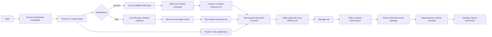
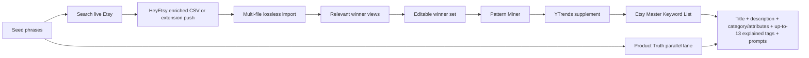

# OmniSeller R4.3 — Single-Path Workflow, Repo Cleanup and Delivery Plan

**Status:** amended draft — not an activated implementation contract  
**Source baseline originally inspected:** `codex/omniseller-r3-g4-commerce` at `e674600d3`  
**Objective:** restore one usable 40–60 minute staff journey from market data to an editable listing package, without rebuilding the good foundations already present.

> **Controlling amendment:** this document must be read together with
> `OMNISELLER_R4_3_AMENDMENT_A_FINAL_REVIEW_INTEGRATION_20260911.md`. Where the
> two conflict, Amendment A controls. R4.3 does not replace `GOLDEN_RULES_V2`
> or the R3 security/release governance. No cleanup, merge or deployment is
> authorized by this document alone.

> **2026-09-11 audit addendum:** after this plan was first drafted, the newer unmerged
> candidate `codex/omniseller-r3-marketplace-research-workflows@5bc0c0f2c` was inspected.
> It adds multi-file UI and canonical workflow artifacts, but also makes the ASIN batch
> plan/Cerebro binding mandatory, rejects Cerebro ASINs outside a saved batch, requires
> all saved batches to be bound before the research snapshot, and continues to render
> Smart Pull, Evidence Gate and old research modules beside Canonical Commerce. Those
> behaviors conflict with the R4.2 ruling that run sets are editable conveniences rather
> than locks. The newer candidate therefore strengthens rather than reverses the cleanup
> decision below. It must not be treated as the R4.2 implementation baseline without
> remediation and normal-browser UAT.

---

## 1. Executive ruling

The business workflow is not inherently complex. OmniSeller became difficult because four different control models are visible and partially active at the same time:

1. legacy `EVIDENCE_INTAKE → RESEARCH_ACCEPTED → DNA_ACCEPTED → MKL_FROZEN` state transitions;
2. Smart Pull / Evidence Gate;
3. old Amazon/Etsy research workspaces;
4. the new Canonical Commerce workflow.

The current Amazon workspace renders Smart Pull, Canonical Commerce, a legacy Evidence Gate and three legacy tools on one page. Etsy does the same. The staff therefore sees duplicated inputs, duplicated research concepts, disabled legacy buttons and a canonical form whose step order does not match R4.2.

**Final decision:** do not rewrite OmniSeller and do not add another parallel workflow. Replace the active workspace orchestration with one R4.2 path, transplant the proven donor logic into that path, then archive the now-unreachable UI and APIs.

The release is complete only when a normal staff account processes the real Hija inputs in the deployed browser, refreshes the page, reopens the project and still sees the editable output.

---

## 2. The one operating model



There is one shared shell and two marketplace-specific research paths. Product Truth remains independent of research: staff may fill it at any time, but it only becomes required when generating customer-facing copy and image prompts.

There is no Evidence Gate, DNA acceptance, MKL freeze, accepted batch or proof that a Cerebro file belongs to a saved batch in the staff journey.

---

## 3. Amazon staff workflow

```mermaid
flowchart LR
    A1[Seed and basic target context] --> A2[Upload one or many Xray files]
    A2 --> A3[Direct/adjacent/irrelevant/uncertain ASIN views]
    A3 --> A4[Edit and copy any 1 to 10 ASIN run set]
    A4 --> A5[Run Cerebro in Helium 10]
    A5 --> A6[Upload one or many Cerebro files]
    A6 --> A7[Keyword x ASIN matrix]
    A7 --> A8[MKL / Outliers / Residue / Roots]
    A8 --> A9[Product Truth ready?]
    A9 --> A10[Title + Item Highlights + bullets + description + backend + A+ + prompts]
```



### Step A0 — project and seed

Staff chooses the existing Amazon workspace/project and enters one or more EN/ES seed phrases plus lightweight target context. This context is only for relevance selection; it is not a long Product Truth questionnaire.

### Step A1 — Xray input

- One file picker accepts multiple `.xlsx`/`.csv` files in one selection.
- Files can also be added later.
- Every raw file, hash, sheet, row and source column is retained.
- Each row is classified `DIRECT`, `ADJACENT`, `IRRELEVANT` or `UNCERTAIN` before revenue/review scoring.
- Staff sees recommended views: core current winners, organic authority, emerging winners, low-review traction, offer diversity and adjacent discovery.
- Staff may override the recommendation.

### Step A2 — Cerebro run sets

- OmniSeller recommends editable groups of at most ten ASINs.
- The first ASIN is explicitly marked as the hero/reference ASIN.
- A group is a copy convenience, not an approval artifact.
- Staff may change it at any time; no lock is saved and no state is advanced.

### Step A3 — Cerebro input

- One picker accepts multiple Cerebro exports together or later.
- Cerebro is the required Amazon keyword source for the normal R4.2 flow; Xray is the normal upstream selector, not a mandatory technical gate.
- If staff already has a valid Cerebro export, OmniSeller processes it without requiring an Xray file or batch proof.
- Every dynamic ASIN rank column is retained and merged into the keyword-by-ASIN evidence matrix.
- A best-overlap run-set label may be shown as informational metadata only.

### Step A4 — Amazon Master Keyword List

No keyword disappears. Every phrase lands in exactly one visible lane:

- `MKL_CORE` — relevant competitor consensus;
- `OUTLIER_OPPORTUNITY` — narrower but meaningful demand/rank;
- `RESIDUE` — sparse, uncertain or low-priority evidence kept for review;
- `BLOCKED` — irrelevant, protected or conflicting claim, with an explicit reason.

The screen shows sources, support percentage, individual ranks, demand/activity metrics, missing-data confidence and the proposed surfaces. Staff may change priority or placement.

### Step A5 — Product Truth and output

Product Truth is populated by supplier data, a company listing, a confirmed same-source reference listing/HTML or manual staff entry. Only name and product type are initially required; missing facts remain `UNKNOWN`.

The composer then allocates eligible keywords across:

- Amazon title;
- searchable Item Highlights;
- up to five bullets;
- description;
- backend terms within the versioned policy resolver's category/marketplace byte limit, without visible-copy duplication;
- A+ copy/creative brief;
- full image job prompts;
- PPC targeting, with unverified-claim flags where policy permits.

Unsupported `925`, `18k`, material, size, production method, packaging or delivery claims cannot enter visible copy or image prompts.

---

## 4. Etsy staff workflow



### Step E1 — live evidence first

- Staff searches the current Etsy US results for one or more seeds.
- HeyEtsy supplies the available sold, views, favorites, revenue, conversion, age, tags and shop/listing fields.
- Staff uploads all CSV/HTML captures in one selection or pushes them through the existing extension/integration path.
- A malformed file is reported separately and does not discard the valid files.
- Repeated listings remain repeated observations while also contributing to one listing entity.

### Step E2 — winners and Pattern Miner

Relevance is the first gate. Separate, explainable views show current organic leaders, sales/traction leaders, emerging winners, conversion candidates, engagement leaders and pattern diversity. Staff can add or remove winners freely.

Pattern Miner reuses the strongest 22etsy-agent behavior:

- source-seed matching;
- actual competitor tags;
- title vocabulary and first-40-character patterns;
- repeated multi-word phrases;
- personalization/product/gift structure;
- price and shop concentration;
- review-derived recipient, occasion and objection language;
- image, variation and personalization jobs.

Patterns teach market language and presentation. They never become product material, process or packaging facts.

### Step E3 — YTrends supplement

The direct MCP adapter is retained, but YTrends is a secondary source. It suggests related terms, trends, niches and gaps. Captured Etsy/HeyEtsy values win whenever sources overlap. Provider failure never blocks processing of staff files.

### Step E4 — Etsy Master Keyword List and output

All phrases are classified by intent and provenance. Up to 13 tags are selected as a set-cover problem over distinct buyer intents; they are not merely the top numeric scores. Each selected tag and each rejected high-value alternative has a reason. If fewer than 13 safe, distinct and relevant tags exist, the output reports `TAG_SHORTAGE` instead of padding.

The result includes title, full natural description, category/attribute recommendations, up to 13 unique tags within the resolved Etsy policy limit and the full image-prompt package.

---

## 5. What the current OmniSeller keeps, merges and removes

### 5.1 KEEP — proven foundation

| Area | Keep | Why |
|---|---|---|
| Account boundary | `AuthContext`, login, roles, workspace switching, user management | One shared account/workspace/project model already exists. |
| Project shell | project create/select and tenant/workspace/project scoping | Required for remote staff and persisted work. |
| Raw research | `research_imports`, raw bytes, SHA-256, parser binding, `research_snapshots` | Correct lossless and auditable intake foundation. |
| Product Truth | project-scoped revisions, confirmation, listing/HTML parser, workbook parser | Correct domain; simplify UI, do not discard safety. |
| Commerce parsers | `spreadsheetReader`, `amazonResearchAdapter`, `etsyResearchAdapter`, `storedResearch`, `etsyPastedSearchParser` | Already handles real files and honest missing values. |
| Safety | `claimGuard`, IP screen, policy contracts, output audit | Proven defect prevention; mandatory at output boundary. |
| Draft/revisions | canonical draft service, listing revisions, exact review package, submission handoff | Correct persistence and Manager/Owner control. |
| Output engines | Amazon/Etsy intelligence adapters, allocation, composer, image prompt generator | Reuse and improve; do not create a new renderer. |
| Security | auth middleware, route registry, rate limiting, URL guard, tenant tests | Required production controls. |

### 5.2 TRANSPLANT / REWIRE — keep the value, replace the orchestration

| Current/donor area | Action |
|---|---|
| Amazon `AmazonPipelineWorkflow` | Extract file parsing presentation and ASIN selection concepts into the new Amazon R4.2 step; archive the old component afterward. |
| FBM Toolkit research modules | Adapt relevance scoring, variation/title dedupe, ASIN views, evidence matrix, roots and MKL lanes behind canonical project APIs. Do not vendor the entire donor repo. |
| `MasterKeywordTable` | Retain the table/editor concept, replace legacy 5-tier/state dependency with R4.2 lanes and provenance. |
| `EtsyMultiSellerScanner` | Retain useful import/pull UI patterns; replace one-file and MCP-primary behavior with HeyEtsy multi-file live-first intake. |
| 22etsy-agent | Adapt multi-file router, captured-value-wins merge, Pattern Miner and Keyword Lab. Do not copy its login, standalone UI or CSV database. |
| `SmartPullAnalyticsBar` / YTrends | Move into a small optional “Bổ sung YTrends” action inside Etsy research. It must not be a parallel workflow or gate. |
| Product listing simulator | Reuse its editable preview behavior inside the final draft/QA step; remove it as a competing top-level workflow tab. |
| Saved catalog/history | Keep as the project’s Drafts/QA/Submitted view, bound to canonical listing revisions. |

### 5.3 ARCHIVE AND REMOVE FROM THE ACTIVE PATH

| Item | Final disposition | Reason |
|---|---|---|
| `ProjectEvidenceGate.jsx` and staff Evidence Gate UI | Archive branch, delete from active imports | Research files are useful inputs; “qualifying evidence” is not a prerequisite for MKL/listing work. |
| UI transitions `EVIDENCE_INTAKE → RESEARCH_ACCEPTED → DNA_ACCEPTED → MKL_FROZEN` | Remove from staff UI; migrate old projects; then retire transition route | They model governance, not the real staff sequence, and caused the blocking loop. |
| Three “Công cụ cũ” tabs in each workspace | Remove after donor functions are transplanted | Their presence creates two competing products on one page. |
| Standalone `public/product-truth-staff.html` | Archive | Product Truth must use the same login, workspace and project inside OmniSeller. |
| `LearningBoxWidget` as “DNA acceptance” | Archive UI | Xray rows are not full listing DNA; useful pattern logic belongs in marketplace Pattern Miner. |
| `MarketBenchmarkWidget` as a separate gate | Archive UI | Its useful metrics belong in ASIN/winner views, not another go/no-go workflow. |
| Disabled legacy listing generators | Remove | A disabled duplicate generator has no operational value. |
| Mandatory batch lock and Cerebro-to-batch proof | Remove | Run sets are editable conveniences; keyword evidence is the valuable output. |
| `Dashboard.jsx`, `AgentHub.jsx`, `AgentChat.jsx`, `AsinBatcherWidget.jsx`, `BatchCsvGenerator.jsx`, `SingleListingGenerator.jsx` if confirmed unreachable by import graph | Archive branch, delete from active tree | Dead/prototype surfaces increase search noise and regression scope. |
| Duplicate legacy endpoints such as generic upload/trend/draft routes | Retire only after the R4.2 browser path no longer calls them | Avoid two persistence paths and two truth models. |
| Old implementation reports in active docs navigation | Remove from active branch after indexing their tag/commit | Keep history without presenting obsolete instructions as current. |

“Archive” does not mean copying old code into an `archive/` folder inside the production tree. That would continue to pollute search, tests and future AI reviews. Archive means:

1. tag the exact pre-cleanup commit;
2. push an immutable archive branch;
3. create a short `docs/ARCHIVE_INDEX.md` containing tag, commit and recovery commands;
4. delete unreachable files from the active branch;
5. verify the archive exists remotely before any worktree cleanup.

Git history is the recovery mechanism. The production branch stays small and unambiguous.

---

## 6. Target active repository structure

```text
src/
  app/
    AppShell.jsx
    MarketplaceWorkspace.jsx
  amazon/
    AmazonResearchFlow.jsx
    XrayImportStep.jsx
    AsinSelectionStep.jsx
    CerebroImportStep.jsx
    AmazonMklStep.jsx
  etsy/
    EtsyResearchFlow.jsx
    EtsyLiveImportStep.jsx
    WinnerSelectionStep.jsx
    PatternMinerStep.jsx
    EtsyMklStep.jsx
  shared/
    ProjectPicker.jsx
    ProductTruthPanel.jsx
    DraftEditor.jsx
    ReviewQueue.jsx
    ImportReceipt.jsx

server/
  routes/
    auth.js
    projects.js
    amazonResearch.js
    etsyResearch.js
    productTruth.js
    listings.js
    review.js
  research/
    amazon/
      xrayParser.js
      asinSelector.js
      cerebroParser.js
      keywordMatrix.js
      masterKeywordBuilder.js
    etsy/
      heyectsyParser.js
      observationMerge.js
      winnerSelector.js
      patternMiner.js
      ytrendsSupplement.js
      masterKeywordBuilder.js
  commerce/
    allocation.js
    amazonComposer.js
    etsyComposer.js
    imagePromptGenerator.js
  truth/
  policy/
  security/
  persistence/

tests/
  unit/
  integration/
  uat/
    amazon-hija.browser.cjs
    etsy-hija.browser.cjs

docs/
  CURRENT_ARCHITECTURE.md
  STAFF_RUNBOOK_VI.md
  REAL_INPUT_UAT.md
  ARCHIVE_INDEX.md
```

This is a target organization, not permission to perform a big-bang file move before behavior works. First establish the new active route with existing modules; extract `server.js` mechanically only after both vertical slices pass browser UAT.

---

## 7. Minimal canonical data model

Reuse the existing canonical storage. Do not create parallel listing or research databases.

```text
workspace + project
  ├─ research_imports          immutable raw files and hashes
  ├─ research_snapshots        parsed observations and staff selections
  ├─ master keyword artifact  explained MKL, outliers, residue and blocked lanes
  ├─ product_truth_revisions   supplier/company/manual facts
  └─ listings
       └─ listing_revisions    draft, QA and submitted package history
```

R4.2 requires the MKL to exist independently of Product Truth. The present `intelligence_snapshots` binding makes that separation unclear. Do not pre-approve a new `keyword_snapshots` table: first adjudicate whether the generic append-only `commerce_workflow_artifacts` model from donor `5bc0c0f2c...` can be the single immutable store for Master Keyword artifacts. The physical schema is accepted only after scope, CAS/idempotency, upgrade, restart, rollback and legacy-read tests. Listing revisions must bind the exact accepted MKL artifact and Product Truth revision used to compose them.

---

## 8. Delivery plan

The implementation is one integrated recovery, not “two days of automation plus five unrelated days of tool work.” Work is delivered in vertical slices that a staff account can use.

| Day | Deliverable | Release gate |
|---:|---|---|
| 0–0.5 | Freeze `origin/main@a02db42f...` and donor `5bc0c0f2c...`, create local recovery refs, dependency/import graph and schema receipt | No remote archive without Owner authorization; no production mutation. |
| 1 | One workspace shell; remove legacy gates/tabs from active render; multi-file import component and per-file receipts | Login → project → select multiple real files works after refresh. |
| 2 | Amazon Xray parser/views, editable ASIN run sets, no locks | All 19 Hija Xray rows and all 32 columns accounted; staff can copy any 1–10 ASINs. |
| 3 | Multi-Cerebro matrix, R4.2 MKL lanes/roots, Amazon draft/A+/prompts | All 1,099 rows, 40 columns and nine ASIN rank columns accounted; complete editable Hija Amazon package persists. |
| 4 | Etsy multi-file live intake, observation/entity model, editable winner views, Pattern Miner | 195 observations, 176 entities and all 36 source columns accounted; no provider dependency. |
| 5 | Etsy MKL, up-to-13 explained tags, full listing and prompts; optional YTrends supplement | Complete editable Hija Etsy package persists even when YTrends is down; no tag padding. |
| 6 | Correct authorization/operator-reporting chain, browser regression and release-candidate runbook | Exact-SHA RC is eligible for independent review; deployment is not automatic. |
| 7–8 contingency | Only production/browser/provider defects discovered by the gates above | Not used for new scope or architecture changes. |

### Tangible checkpoints

- **End of Day 1:** staff can enter the real workflow; no legacy gate blocks the next step.
- **End of Day 3:** Amazon is usable end-to-end with Hija data.
- **End of Day 5:** Etsy is usable end-to-end with Hija data.
- **End of Day 6 target:** local release-candidate proof. VPS deploy occurs only after exact-SHA CI/Linux/migration/browser gates and Owner authorization.

If a gate fails, work stays on that vertical slice. It does not proceed to refactoring, new agents, new providers or documentation expansion.

---

## 9. Expected staff time after completion

### Amazon

| Work | Target active time |
|---|---:|
| Upload/review Xray and copy run set | 5–10 min |
| External Helium 10 Cerebro operation | 10–20 min |
| Upload Cerebro and review MKL | 5–10 min |
| Confirm/reuse Product Truth | 5–10 min |
| Generate, edit and save QA package | 5–10 min |
| **Total** | **30–60 min** |

### Etsy

| Work | Target active time |
|---|---:|
| Search/capture/upload live evidence | 5–15 min |
| Review winners and Pattern Miner | 5–10 min |
| Review MKL and 13-tag rationale | 5–10 min |
| Confirm/reuse Product Truth | 5–10 min |
| Generate, edit and save QA package | 5–10 min |
| **Total** | **25–55 min** |

For a product family with reusable Product Truth, both paths should be faster. The purpose is not to beat an arbitrary number; it is to eliminate duplicate entry and prevent unsafe or unexplained output.

---

## 10. Definition of done and stop rules

### Required Amazon proof

- multiple Xray files can be selected together and added later;
- all real Hija Xray data is accounted;
- ASIN groups are editable and never locked;
- multiple Cerebro files can be selected together and added later;
- a Cerebro file is accepted without saved-batch proof;
- every keyword and every ASIN-rank column is accounted in MKL/outlier/residue/blocked;
- complete Amazon listing, A+ brief and full prompts are editable and persisted;
- unsupported claims do not enter visible copy/prompts.

### Required Etsy proof

- multiple HeyEtsy CSV/HTML captures can be selected together and added later;
- valid files survive a malformed neighbor;
- all observations and source columns are accounted;
- winner selection and Pattern Miner are editable and explained;
- YTrends adds data but never overwrites live capture and never blocks the flow;
- complete Etsy listing, up to 13 safe, distinct and explained tags (or explicit `TAG_SHORTAGE` with missing count), and full prompts are editable and persisted.

### Browser proof

For both marketplaces:

```text
fresh staff login
→ choose existing workspace/project
→ process real files
→ reach complete draft
→ edit and save NEEDS_QA
→ refresh browser
→ reopen same project
→ all inputs, MKL decisions and output remain
```

### Explicit stop rules

- Do not merge because a unit/API count is green while browser UAT fails.
- Do not build another standalone UI.
- Do not add a stage, approval or evidence gate unless it protects an irreversible action.
- Do not refactor the 4,762-line server before the Amazon and Etsy vertical slices work.
- Do not add provider automation to the critical path.
- Do not add Phase 2 marketplace publishing, ad optimization or first-party analytics before the manual-submission chain through `OPERATOR_REPORTED_SUBMITTED` works.

---

## 11. Source-audit evidence for this ruling

At `e674600d3`:

- `AmazonWorkspace.jsx` renders Smart Pull, `CanonicalCommerceWorkflow`, `ProjectEvidenceGate` and three old workspace tabs together.
- `EtsyWorkspace.jsx` renders the same four control families.
- `CanonicalCommerceWorkflow.jsx` stores only one selected research file and reads `event.target.files[0]`.
- its Amazon readiness calculation explicitly expects both `AMAZON_CEREBRO` and `AMAZON_XRAY`.
- the server still creates projects in `EVIDENCE_INTAKE`, exposes the legacy transition API and retains duplicate legacy upload/draft/research routes alongside canonical routes.
- the active frontend contains roughly 10,066 JS/JSX lines; the server contains roughly 16,098 JS lines, including an approximately 4,762-line `server.js`; there are 82 Express route declarations and 87 `.cjs` tests. Size alone is not the defect, but it confirms why adding a fifth orchestration path is unacceptable.

These findings explain the screenshots: the current implementation did not faithfully replace the old workflow with R4.2. It placed R4.2-like controls above the old system and tried to bypass the old locks locally.

---

## 12. Final decision table

| Question | Decision |
|---|---|
| Rewrite OmniSeller? | No. |
| Keep the old UI beside the new UI? | No. |
| Keep canonical auth/project/persistence/revisions/security? | Yes. |
| Keep and improve current commerce composers/guards? | Yes. |
| Transplant donor parsers/scoring/pattern logic? | Yes, module by module with tests. |
| Vendor full donor applications? | No. |
| Require Xray and Cerebro simultaneously? | No. Xray is the normal selector; Cerebro is processed independently. |
| Lock ASIN batches or prove Cerebro ancestry? | No. |
| Make YTrends primary Etsy evidence? | No. Live Etsy/HeyEtsy is primary. |
| Keep legacy code in an `archive/` production folder? | No. Use a remote tag/branch plus archive index. |
| Production-ready when tests pass? | No. Only after real browser UAT on VPS. |
| Delivery expectation | Six focused days is an optimistic local-RC target; plan eight to ten working days for merge-ready exact-SHA evidence. VPS deployment remains conditional on gates and Owner authorization. |
